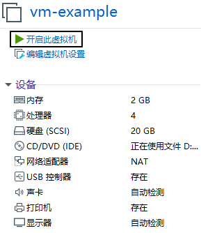
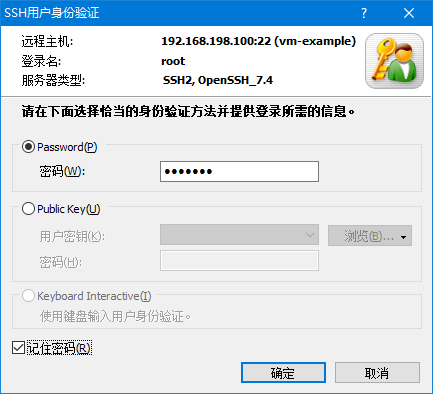
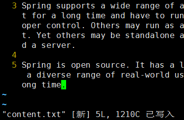

# Linux笔记

* [1.Linux概述](#1linux概述)
  * [1.1.为什么要使用Linux](#11为什么要使用linux)
    * [①性能强劲，安全稳定](#性能强劲安全稳定)
    * [②可定制](#可定制)
    * [③免费或少许费用](#免费或少许费用)
    * [④硬件配置要求低](#硬件配置要求低)
    * [⑤嵌入移动设备](#嵌入移动设备)
  * [1.2.Linux之父](#12linux之父)
  * [1.3.Linux发行版](#13linux发行版)
    * [①RedHat](#redhat)
    * [②Fedora](#fedora)
    * [③Debian](#debian)
    * [④Ubuntu](#ubuntu)
    * [⑤CentOS](#centos)
* [2.Linux系统安装](#2linux系统安装)
  * [2.1.安装计划](#21安装计划)
  * [2.2.安装VMWare虚拟机软件](#22安装vmware虚拟机软件)
  * [2.3.在VMWare中创建虚拟机](#23在vmware中创建虚拟机)
  * [2.4.安装CentOS系统](#24安装centos系统)
  * [2.5.BIOS虚拟化支持问题](#25bios虚拟化支持问题)
    * [故障现象](#故障现象)
    * [解决办法](#解决办法)
  * [2.6.Xshell和Xftp](#26xshell和xftp)
    * [Linux系统的远程连接](#linux系统的远程连接)
    * [连接前的准备](#连接前的准备)
      * [确认网络连接](#确认网络连接)
      * [安装软件](#安装软件)
    * [Xshell的使用](#xshell的使用)
      * [新建连接](#新建连接)
      * [连接](#连接)
    * [Xftp的使用](#xftp的使用)
      * [打开Xftp](#打开xftp)
      * [确认连接信息](#确认连接信息)
* [3.Linux常用指令](#3linux常用指令)
  * [3.1.背景知识](#31背景知识)
    * [Linux系统中一切皆文件](#linux系统中一切皆文件)
    * [Linux文件系统](#linux文件系统)
    * [Linux系统中的路径](#linux系统中的路径)
    * [用户的家目录](#用户的家目录)
    * [文件扩展名不敏感](#文件扩展名不敏感)
    * [一级目录简介](#一级目录简介)
  * [3.2.快捷键](#32快捷键)
  * [3.3.创建目录mkdir](#33创建目录mkdir)
  * [3.4.进入目录cd](#34进入目录cd)
  * [3.5.查看目录内容ls](#35查看目录内容ls)
  * [3.6.打印所在绝对路径pwd](#36打印所在绝对路径pwd)
  * [3.7.新建文件touch](#37新建文件touch)
  * [3.8.复制cp](#38复制cp)
  * [3.9.移动mv](#39移动mv)
  * [3.10.删除rm](#310删除rm)
  * [3.11.Vim](#311vim)
    * [简介](#简介)
    * [三种模式](#三种模式)
    * [基本操作](#基本操作)
      * [打开一个文件](#打开一个文件)
      * [进入编辑模式](#进入编辑模式)
      * [显示行号](#显示行号)
      * [保存已修改的内容](#保存已修改的内容)
      * [退出](#退出)
      * [保存退出](#保存退出)
      * [不保存退出](#不保存退出)
    * [看](#看)
      * [上下左右移动光标](#上下左右移动光标)
      * [前往指定行](#前往指定行)
    * [改](#改)
    * [编](#编)
    * [搜](#搜)
      * [初始状态](#初始状态)
      * [进入指令模式](#进入指令模式)
      * [输入关键词](#输入关键词)
      * [回车执行搜索](#回车执行搜索)
      * [遍历匹配内容](#遍历匹配内容)
      * [取消高亮显示](#取消高亮显示)
    * [替](#替)
      * [新建文件](#新建文件)
      * [执行替换](#执行替换)
      * [效果](#效果)
      * [重新替换](#重新替换)
    * [常见问题](#常见问题)
      * [另一种形式的指令模式](#另一种形式的指令模式)
      * [提示存在交换文件](#提示存在交换文件)
      * [屏幕被锁](#屏幕被锁)
  * [3.12.显示文件全部内容cat](#312显示文件全部内容cat)
  * [3.13.分屏查看文件less](#313分屏查看文件less)
    * [简介](#简介-1)
    * [用法](#用法)
      * [使用less命令打开文件](#使用less命令打开文件)
      * [less环境](#less环境)
      * [控制方式](#控制方式)
  * [3.14.显示文件末尾内容tail](#314显示文件末尾内容tail)
    * [简介](#简介-2)
    * [基本用法](#基本用法)
    * [高级用法](#高级用法)
  * [3.15.查找文件或目录find](#315查找文件或目录find)
  * [3.16.基于索引查询文件或目录locate](#316基于索引查询文件或目录locate)
    * [简介](#简介-3)
    * [索引](#索引)
    * [locate命令的原理](#locate命令的原理)
    * [操作演示](#操作演示)
      * [使用locate命令](#使用locate命令)
      * [新建文件后再搜索](#新建文件后再搜索)
      * [更新索引库后再搜索](#更新索引库后再搜索)
  * [3.17.将文件内容中匹配的行返回grep](#317将文件内容中匹配的行返回grep)
    * [基本用法](#基本用法-1)
    * [特殊用法](#特殊用法)
      * [原始文件](#原始文件)
      * [返回匹配的行并显示行号](#返回匹配的行并显示行号)
      * [返回不匹配的行并显示行号](#返回不匹配的行并显示行号)
      * [结论](#结论)
  * [3.18.管道pipe](#318管道pipe)
    * [概述](#概述)
    * [举例](#举例)
      * [需求](#需求)
      * [文件和目录的特征](#文件和目录的特征)
      * [按照特征编写正则表达式](#按照特征编写正则表达式)
      * [完整的命令](#完整的命令)
      * [工作机制解析](#工作机制解析)
      * [管道可以多重使用](#管道可以多重使用)
  * [3.19.解压命令tar](#319解压命令tar)
    * [简介](#简介-4)
    * [tar包解压命令](#tar包解压命令)
  * [3.20.查看当前正在运行的进程ps](#320查看当前正在运行的进程ps)
    * [简介](#简介-5)
    * [进程信息中各列数据说明](#进程信息中各列数据说明)
    * [父进程和子进程之间的关系](#父进程和子进程之间的关系)
    * [和其他命令配合](#和其他命令配合)
      * [分屏查看进程信息](#分屏查看进程信息)
      * [精确查询一个具体进程信息](#精确查询一个具体进程信息)
  * [3.21.杀死进程kill](#321杀死进程kill)
    * [简介](#简介-6)
    * [举例](#举例-1)
      * [打开火狐浏览器](#打开火狐浏览器)
      * [查看火狐浏览器的进程id](#查看火狐浏览器的进程id)
      * [使用kill命令结束火狐浏览器进程](#使用kill命令结束火狐浏览器进程)
  * [3.22.实时查看系统运行情况和健康状态top](#322实时查看系统运行情况和健康状态top)
    * [简介](#简介-7)
    * [细节](#细节)
      * [命令与参数](#命令与参数)
      * [操作控制](#操作控制)
      * [查询结果字段解释](#查询结果字段解释)
  * [3.23.查看网络状态netstat](#323查看网络状态netstat)
    * [简介](#简介-8)
    * [说明](#说明)
      * [网络连接信息](#网络连接信息)
      * [进程间通信信息](#进程间通信信息)
    * [使用技巧](#使用技巧)
      * [分屏查看](#分屏查看)
      * [根据进程名称查看网络状态](#根据进程名称查看网络状态)
      * [根据端口号查看网络状态](#根据端口号查看网络状态)
  * [3.24.查看命令历史history](#324查看命令历史history)
  * [3.24.打印环境变量的值echo](#324打印环境变量的值echo)
    * [简介](#简介-9)
    * [关于standard output](#关于standard-output)
      * [本质](#本质)
      * [对比Java代码](#对比java代码)
    * [输出环境变量](#输出环境变量)
      * [Linux中引用环境变量](#linux中引用环境变量)
      * [使用echo输出环境变量](#使用echo输出环境变量)
  * [3.25.命令帮助](#325命令帮助)
    * [概述](#概述-1)
    * [用法](#用法-1)
      * [man命令](#man命令)
      * [info命令](#info命令)
      * [补充](#补充)
  * [3.26.关机重启](#326关机重启)
    * [意识](#意识)
    * [相关命令](#相关命令)
  * [3.27.换行符\\(反斜杠)](#327换行符反斜杠)
  * [3.28.给服务器发送请求curl](#328给服务器发送请求curl)
  * [3.29.不挂断运行nohup](#329不挂断运行nohup)
    * [提出问题](#提出问题)
    * [命令的前台运行和后台运行](#命令的前台运行和后台运行)
      * [前台运行](#前台运行)
      * [不挂断运行](#不挂断运行)
  * [3.30.下载文件wget](#330下载文件wget)
  * [3.31.正则表达式](#331正则表达式)
  * [3.32.基名basename](#332基名basename)
  * [3.33.路径名dirname](#333路径名dirname)
  * [3.34.字符串切割cut](#334字符串切割cut)
  * [3.35.字符串命令awk](#335字符串命令awk)
    * [基本用法](#基本用法-2)
    * [测试](#测试)
  * [3.36.文件内容排序sort](#336文件内容排序sort)
  * [3.37.建立管道数据与命令行参数的联系xargs](#337建立管道数据与命令行参数的联系xargs)
    * [情景举例](#情景举例)
      * [初始状态](#初始状态-1)
      * [需求](#需求-1)
      * [分步实现](#分步实现)
    * [结论](#结论-1)
  * [3.38.一些面试真题](#338一些面试真题)
    * [京东](#京东)
      * [问题1](#问题1)
      * [问题2](#问题2)
    * [新浪](#新浪)
    * [金和网络](#金和网络)
* [4.Linux系统的管理与维护](#4linux系统的管理与维护)
  * [4.1.Linux系统的权限控制](#41linux系统的权限控制)
    * [权限](#权限)
    * [基础命令](#基础命令)
    * [文件权限信息说明](#文件权限信息说明)
    * [chxxx命令](#chxxx命令)
      * [修改权限信息前](#修改权限信息前)
      * [修改权限信息](#修改权限信息)
      * [修改权限信息后](#修改权限信息后)
      * [再次修改权限信息](#再次修改权限信息)
      * [修改权限信息后](#修改权限信息后-1)
    * [普通用户提升权限](#普通用户提升权限)
  * [4.2.Linux系统的服务管理](#42linux系统的服务管理)
    * [服务的概念](#服务的概念)
    * [CentOS6服务](#centos6服务)
      * [service命令](#service命令)
      * [chkconfig命令](#chkconfig命令)
      * [运行级别](#运行级别)
      * [防火墙](#防火墙)
    * [CentOS7服务](#centos7服务)
      * [systemctl命令](#systemctl命令)
      * [systemctl命令代替chkconfig命令](#systemctl命令代替chkconfig命令)
      * [CentOS7简化了运行级别](#centos7简化了运行级别)
      * [关闭防火墙](#关闭防火墙)
  * [4.3.Linux系统环境下Shell脚本开发](#43linux系统环境下shell脚本开发)
    * [Shell编程概述](#shell编程概述)
      * [Linux系统提供的Shell解析器](#linux系统提供的shell解析器)
      * [bash和sh的关系](#bash和sh的关系)
      * [Linux默认的解析器是bash](#linux默认的解析器是bash)
      * [Shell语法总述](#shell语法总述)
    * [Shell编程HelloWorld](#shell编程helloworld)
      * [创建脚本文件](#创建脚本文件)
      * [脚本内容](#脚本内容)
      * [Shell脚本的运行方式](#shell脚本的运行方式)
    * [变量](#变量)
      * [系统预定义变量](#系统预定义变量)
      * [使用set命令查看所有变量](#使用set命令查看所有变量)
      * [自定义变量](#自定义变量)
        * [基本语法](#基本语法)
        * [语法规则](#语法规则)
      * [特殊变量](#特殊变量)
        * [$n](#n)
        * [$#](#)
        * [\$*和$@](#和)
        * [$?](#-1)
    * [运算符](#运算符)
    * [条件判断](#条件判断)
      * [基本语法](#基本语法-1)
      * [常用判断条件](#常用判断条件)
    * [流程控制](#流程控制)
      * [三目运算](#三目运算)
      * [if判断](#if判断)
        * [单if](#单if)
        * [if...else](#ifelse)
        * [if...elif](#ifelif)
      * [case判断](#case判断)
      * [for循环](#for循环)
      * [for in循环](#for-in循环)
      * [while循环](#while循环)
    * [函数](#函数)
    * [获取脚本外部数据](#获取脚本外部数据)
      * [获取参数](#获取参数)
      * [使用read读取用户输入](#使用read读取用户输入)
  * [4.4.服务器端应用程序安装](#44服务器端应用程序安装)
    * [开辟退路](#开辟退路)
      * [备份配置文件](#备份配置文件)
      * [拍摄快照](#拍摄快照)
        * [用法一](#用法一)
        * [用法二](#用法二)
    * [安装JDK](#安装jdk)
      * [rpm命令](#rpm命令)
      * [卸载系统预装的JDK](#卸载系统预装的jdk)
      * [解压JDK的tar包配置环境变量](#解压jdk的tar包配置环境变量)
        * [解压JDK的tar包](#解压jdk的tar包)
        * [配置JDK相关环境变量](#配置jdk相关环境变量)
    * [安装Tomcat](#安装tomcat)
      * [解压](#解压)
      * [操控](#操控)
      * [访问](#访问)
    * [MySQL安装步骤](#mysql安装步骤)
      * [卸载系统预装mariadb](#卸载系统预装mariadb)
      * [安装服务器端程序](#安装服务器端程序)
      * [安装客户端程序](#安装客户端程序)
      * [启动MySQL服务](#启动mysql服务)
      * [设置root用户密码](#设置root用户密码)
      * [登录MySQL](#登录mysql)
      * [客户端登录MySQL服务器](#客户端登录mysql服务器)
        * [被防火墙拦截的错误提示](#被防火墙拦截的错误提示)
        * [被MySQL自己拒绝连接](#被mysql自己拒绝连接)
        * [在MySQL服务器端设置允许任何主机地址访问](#在mysql服务器端设置允许任何主机地址访问)
      * [解决字符乱码问题](#解决字符乱码问题)
        * [查看字符相关变量](#查看字符相关变量)
        * [准备MySQL配置文件](#准备mysql配置文件)
  * [4.5.VMWare软件联网原理说明与故障解决](#45vmware软件联网原理说明与故障解决)
    * [原理](#原理)
    * [常见问题1：Windows端虚拟网卡虚拟网络连接丢失](#常见问题1windows端虚拟网卡虚拟网络连接丢失)
    * [常见问题2：虚拟网络连接IP地址乱了](#常见问题2虚拟网络连接ip地址乱了)
    * [常见问题3：各方面正常就是连不上](#常见问题3各方面正常就是连不上)

# 1.Linux概述

## 1.1.为什么要使用Linux

Linux内核最初只是由芬兰人林纳斯·托瓦兹（Linus Torvalds）在赫尔辛基大学上学时出于个人爱好而编写的。

Linux是一套免费使用和自由传播的类Unix操作系统，是一个基于POSIX和UNIX的多用户、多任务、支持多线程和多CPU的操作系统。Linux能运行主要的UNIX工具软件、应用程序和网络协议。它支持32位和64位硬件。Linux继承了Unix以网络为核心的设计思想，是一个性能稳定的多用户网络操作系统。

目前市面上较知名的发行版有：Ubuntu、RedHat、CentOS、Debain、Fedora、SuSE、OpenSUSE。

Linux的优势主要体现在下面几个方面：

### ①性能强劲，安全稳定

Linux本来就是基于Unix概念而发展出来的操作系统，当然也继承了Unix稳定高效的特点。使用Linux系统的主机连续工作1年以上不死机、不重启是非常常见的。所以很多电影、动画中的特效制作这样需要强大运算能力的工作都是运行在Linux系统之上。

### ②可定制

如果你对Linux足够了解，完全可以使用Linux内核搭配需要的组件构成一个定制版系统，甚至你可以修改Linux源码进行深度定制

### ③免费或少许费用

学习Linux可以免费使用Linux的各种发行版，在商业用途中往往也只是支付很少的费用即可

### ④硬件配置要求低

Linux内核只有几KB大小，仅运行内核的话需要的系统开销很小，以命令行方式操作Linux也一样。以图形化界面方式运行Linux需要的资源也比Windows更少。

### ⑤嵌入移动设备

由于Linux只需要很少的资源就能够驱动所有硬件设备工作，所以非常适合嵌入到手机等移动设备中，例如现在我们使用的Android系统就是以Linux为核心的。

## 1.2.Linux之父

林纳斯·托瓦兹最早推出Linux系统内核时只有21岁，此时他已经有了10年编程经验。他的名言是：“<span style="color:blue;font-weight:bold;">Talk is cheap,show me the code!</span>”。


## 1.3.Linux发行版

Linus和他的虚拟团队的工作仅仅是开发了Linux内核以及附带的一些工具，尚不能作为一个完整的可以交给终端用户使用的操作系统。为了方便用户使用，很多的商业公司或非营利团体，就将Linux 内核（包括工具）与可运行的软件整合起来，再加上系统的安装工具。这个『内核+软件+工具』的完全可安装的整体，我们称之为Linux distribution，这就是Linux的发行版，港台腔叫发行套件。这是Linux这样的开放式系统和Windows、Mac等这些封闭式系统的一个显著差别。

初学Linux通常会选择CentOS，这其实是RedHat收费后去掉收费功能而发布的一个免费的社区版。

主要的Linux发行版有：

### ①RedHat

http://www.redhat.com


### ②Fedora

http://fedoraproject.org


### ③Debian

http://www.debian.org


### ④Ubuntu

http://www.ubuntu.com


### ⑤CentOS

CentOS是RedHat的社区版

http://www.centos.org


我们可以从网易开源镜像站获取CentOS系统的镜像文件

http://mirrors.163.com

# 2.Linux系统安装

## 2.1.安装计划

基本思路是使用VMWare这样的虚拟机软件创建一个“虚拟计算机”，在虚拟机上安装Linux系统。


如果由于客观原因确实没法安装虚拟机可以考虑使用云服务器，例如：阿里云、腾讯云、百度云、京东云、华为云等等。

## 2.2.安装VMWare虚拟机软件

主流的版本VMWare10、VMWare12、VMWare15三个版本，装哪个都可以。安装过程没有特殊设置，正常安装即可。

## 2.3.在VMWare中创建虚拟机


## 2.4.安装CentOS系统





## 2.5.BIOS虚拟化支持问题

### 故障现象

启动虚拟机时看到下面这样的错误：


那么就说明当前物理机没有开启虚拟化支持。需要进入BOIS界面打开这个设置。通常出现这个问题的几率是10%左右。

### 解决办法

每个不同品牌的电脑进入BIOS的办法都不尽相同，需要根据实际情况反复尝试。而且需要注意的是有的笔记本电脑需要按住Fn键再按F2、F12等等。

Phoenix BIOS机型


Insyde BIOS机型


## 2.6.Xshell和Xftp

### Linux系统的远程连接

对我们来说，Linux系统是当服务器来用的。而正式的服务器都需要通过网络远程访问。Linux系统运行了专门的进程基于SSH协议来接受客户端的远程连接。SSH客户端也很多，我们使用的是Xshell和Xftp。其中Xshell用来远程运行Linux命令，Xftp用来向Linux上传文件。


### 连接前的准备

#### 确认网络连接

在Windows这边通过ping命令确认从Windows到Linux网络是否连通。

> C:\Users\Administrator>ping 192.168.198.100
>
> 正在 Ping 192.168.198.100 具有 32 字节的数据:
> 来自 192.168.198.100 的回复: 字节=32 时间<1ms TTL=64
> 来自 192.168.198.100 的回复: 字节=32 时间=1ms TTL=64
> 来自 192.168.198.100 的回复: 字节=32 时间=1ms TTL=64
> 来自 192.168.198.100 的回复: 字节=32 时间=2ms TTL=64
>
> 192.168.198.100 的 Ping 统计信息:
>  数据包: 已发送 = 4，已接收 = 4，丢失 = 0 (0% 丢失)，
> 往返行程的估计时间(以毫秒为单位):
>  最短 = 0ms，最长 = 2ms，平均 = 1ms

#### 安装软件

安装Xshell和Xftp这两个软件，可能会需要升级Windows系统的.NET组件或Windows Visual Studio等。

### Xshell的使用

#### 新建连接


#### 连接




点这里调整字体：


下面这样就可以输入Linux命令了：


### Xftp的使用

#### 打开Xftp

由于使用Xshell的频率远高于Xftp，所以最方便的办法从Xshell里打开Xftp。


#### 确认连接信息


# 3.Linux常用指令

## 3.1.背景知识

### Linux系统中一切皆文件

在Linux系统中任何东西都是以文件形式来存储的。这其中不仅包括我们熟知的文本文件、可执行文件等等，还包括硬件设备、虚拟设备、网络连接等等，甚至连目录其实都是一种特殊的文件。

### Linux文件系统

Linux系统环境下的文件系统与Windows有很大区别。
在Windows中，每一个盘符下是一个独立的文件系统，硬盘有多少个分区就有多少个文件系统。


而在Linux系统中不管创建了多少个硬盘分区都只有一个文件系统。整个文件系统的根目录是“/”，从“/”出发可以找到Linux系统中的所有目录和文件。


### Linux系统中的路径

绝对路径：从“/”根目录开始逐层查找文件和目录。

> /etc/sysconfig/network-scripts
>
> /tmp/vmware-root/vmware-db.pl.2267

相对路径：以当前目录或上一级目录为基准逐层查找文件和目录

> 当前目录：“./”
> 当前目录的上一级目录：“../”

“./”可以省略不写，也同样表示当前目录。

<span style="color:red;font-weight:bold;">易错点</span>：“/”代表的是最顶层、最上面的那个根目录，<span style="color:red;font-weight:bold;">不是当前目录</span>啊喂！不是啊！！！


除非你现在所在的位置就是在根目录这里，否则<span style="color:red;font-weight:bold;">“/”和“<span style="color:blue;font-weight:bold;font-size:50px;">.</span>/”就完全是两码事</span>啊！加了一个“<span style="color:blue;font-weight:bold;font-size:50px;">.</span>”意思就完全不一样了！！！

### 用户的家目录

Linux是一个多用户系统，每个登录到系统的用户都需要有一个自己专属的目录保存自己私有的文件。系统当然看到了这个需求，所以每创建一个普通用户，系统就会在<span style="color:blue;font-weight:bold;">/home</span>目录下创建一个和用户同名的目录作为这个用户的家目录。

比如：创建一个名为tom的用户，它的家目录就是/home/tom

可以使用“<span style="color:blue;font-weight:bold;font-size:25px;">~</span>”代表用户的家目录。

特殊的是作为系统的超级管理员，root用户的家目录是/root目录。

### 文件扩展名不敏感

在Windows系统中，操作系统会负责根据文件扩展名识别文件类型，然后再根据文件类型匹配打开这种文件的应用程序。让用户不必记忆大量的对应关系，用哪个直接打开就好了。

而Linux是一个命令行系统，虽然现在也有了图形化界面，但是还是以命令行使用为主。

所以Linux系统中通常是使用命令去打开文件。而这个命令和文件是否匹配，那就需要运行命令的人自己注意。

### 一级目录简介

| 目录名       | 是否重要 | 作用                                                         |
| ------------ | -------- | ------------------------------------------------------------ |
| /bin         |          | bin是binary的缩写，这个目录存放着最经常使用的命令。          |
| /boot        |          | 这里存放的是启动Linux时用到的引导程序文件。                  |
| /dev         |          | device(设备)的缩写，该目录下存放的是Linux的外部设备。        |
| /etc         | √        | 存放系统和第三方应用程序的配置文件。                         |
| /home        | √        | 存放普通用户家目录。                                         |
| /lib和/lib64 |          | 系统开机所需要最基本的动态连接共享库。                       |
| /media       |          | 挂载Linux系统会自动识别的设备，例如U盘、光驱等。             |
| /mnt         |          | 专门用于挂载操作的目录。                                     |
| /opt         | √        | 存放安装第三方应用程序时使用的压缩包文件。                   |
| /proc        |          | 这个目录是一个虚拟的目录，它是系统内存的映射。               |
| /root        | √        | 超级管理员root用户的家目录。                                 |
| /run         |          | 存放进程产生的临时文件，关机重启后会消失。                   |
| /sbin        |          | s是Super User的意思，这里存放的是系统管理员使用的系统管理程序。 |
| /srv         |          | service缩写，该目录存放一些服务启动之后需要提取的数据。      |
| /sys         |          | 该目录下安装了2.6内核中新出现的一个文件系统sysfs。           |
| /tmp         |          | 存放临时文件。                                               |
| /usr         | √        | 应用程序的默认安装目录，类似于Windows下的program files目录。 |
| /var         | √        | 存放经常变化的内容，例如日志文件。                           |

## 3.2.快捷键

命令行环境下快捷键：

| 按键         | 作用         |
| ------------ | ------------ |
| Ctrl+l       | 清屏         |
| Ctrl+c       | 强制终止程序 |
| Ctrl+Insert  | 复制         |
| Shift+Insert | 粘贴         |
| Ctrl+s       | 锁屏         |
| Ctrl+q       | 解除锁屏     |
| tab          | 自动补全     |

## 3.3.创建目录mkdir

命令：mkdir

对应单词：make directory

作用：创建目录

格式：mkdir [OPTION]... DIRECTORY...

创建单层目录：mkdir 新目录的路径

> 单层目录说明：
>
> mkdir aaa/bbb/ccc
>
> 其中aaa/bbb是存在的目录，要创建的仅仅是ccc

创建多层目录：mkdir -p 新目录的路径

> 多层目录说明：
>
> mkdir -p aaa/bbb/ccc/ddd
>
> 其中bbb/ccc/ddd都不存在，现在想一次性把这些目录都建出来

## 3.4.进入目录cd

命令：cd

对应单词：change directory

作用：切换当前目录

格式： cd 目标目录路径

用法1：使用绝对路径

用法2：使用相对路径

用法3：使用~回到家目录

## 3.5.查看目录内容ls

命令：ls

对应单词：list

作用：列出目录中的内容，这里所说的目录可以是当前目录也可以是其他目录（需要指定路径）。

格式：ls [OPTION]... [FILE]...

常用参数

| 参数 | 说明                               |
| ---- | ---------------------------------- |
| -A   | 显示目录内容时把隐藏资源也显示出来 |
| -l   | 以详细信息形式显示资源             |
| -R   | 递归查看目录内容                   |

命令的参数既可以单独使用也可以组合使用。同时ls -l可以简写为ll。

## 3.6.打印所在绝对路径pwd

命令：pwd

对应单词：print work directory

作用：打印当前所在的目录（绝对路径）

举例：

当前目录同样是baby，但是用pwd打印的完整路径却不同


## 3.7.新建文件touch

命令：touch

作用：创建空文件

格式：touch 新建文件的路径

## 3.8.复制cp

命令：cp

对应单词：copy

作用：复制文件或目录

复制文件：cp 被复制的文件的路径  目标目录的路径

复制目录：cp -r 被复制的目录的路径  目标目录的路径

## 3.9.移动mv

命令：mv

对应单词：move

作用：移动文件或目录

格式：mv 被移动的文件或目录的路径 目标目录

特殊效果：将目录或文件在当前位置移动可以起到重命名的作用

## 3.10.删除rm

命令：rm

对应单词：remove

作用：删除目录或文件

删除文件：rm 被删除的文件的路径

强制删除文件：rm -f 被删除的文件的路径

递归删除目录：rm -r 被删除的目录的路径

强制删除目录：rm -rf 被删除的目录的路径

## 3.11.Vim

### 简介

命令：vim

作用：在<span style="color:blue;font-weight:bold;">命令行环境</span>下编辑文本文件

提示：在命令行模式下<span style="color:blue;font-weight:bold;">没有鼠标</span>，所以刚开始使用的时候会觉得非常不习惯。但是慢慢的熟练之后你会发现，不需要鼠标全部用键盘就可以操作效率很高。

### 三种模式


一般模式：通过按键控制VIM工作

编辑模式：可以自由输入

指令模式：通过执行指令完成一些特殊操作

### 基本操作

#### 打开一个文件

[root@localhost ~]# vim content.txt

即使这个文件不存在也没关系，vim知道我们打算新建一个文件。打开后的效果是：


#### 进入编辑模式

进入编辑模式有很多种方法，现在我们先使用其中一种方法：按一下i键。


按键的时候屏幕上是不显示“i”这个字母的，这个需要注意。

然后可以随意输入一些内容。


然后再<span style="color:blue;font-weight:bold;">按Esc键回到一般模式</span>。

#### 显示行号

接着上一步继续，在回到一般模式后，输入<span style="color:blue;font-weight:bold;">英文冒号</span>。我们会看到光标移动到了窗口的底部：


然后输入set nu回车就可以显示行号了。


这时我们其实就使用了一个<span style="color:blue;font-weight:bold;">指令</span>。

#### 保存已修改的内容

当:set nu这个指令执行完成后，vim就又回到了<span style="color:blue;font-weight:bold;">一般模式</span>。此时我们使用<span style="color:blue;font-weight:bold;">:w指令</span>就可以保存文件。




#### 退出

使用:q指令就可以退出vim了


#### 保存退出

:w是保存，:q是退出，:wq就是保存退出


#### 不保存退出

当我们退出vim时，如果有部分修改还没有保存，那么会看到下面的提示：


当我们想要放弃对文件的修改，不保存直接退出就使用:q!


### 看

#### 上下左右移动光标

**方法一**

很容易上手的操作方式，但是距离基准键位较远，熟练使用之后敲击键盘的速度大幅度提升，要移动这么远的举例还是非常不便的。


**方法二**

就在基准键位上，非常方便。


#### 前往指定行

**第一行**

输入gg，将光标定位到第一行开头的位置。此时屏幕上并不会显示你输入了什么，需要你自己心里面知道。


**最后一行**

输入G，将光标定位到最后一行开头的位置。


**指定行号**

假设我们要去第12行，那么依次输入“1”、“2”、“G”即可。这些也不会在屏幕上的任何地方显示，所以还是要我们自己心里清楚。


### 改

这里我们说的是在一般模式下通过按键来编辑文件，并不是进入编辑模式。

| 按键   | 效果                                                         |
| ------ | ------------------------------------------------------------ |
| dd     | 删除光标所在的行                                             |
| d5d    | 从光标所在行开始，向下连续删除5行（包括光标所在行）          |
| u      | 撤销刚才的操作                                               |
| Ctrl+r | 重做刚才撤销的操作                                           |
| yy     | 复制光标所在的行                                             |
| p      | 将当前复制的行粘贴到光标所在位置的下一行                     |
| y3y    | 从光标所在行开始，向下连续复制5行（包括光标所在行）          |
| r      | 替换光标所在位置的一个字符<br />第一步：按一下r键<br />第二步：输入新的字符 |

### 编

这次我们要看看有哪些方法可以进入编辑模式

| 按键 | 大小写<br />说明 | 光标动作                                                     |
| ---- | ---------------- | ------------------------------------------------------------ |
| i    | 小写             | 不动，就在<span style="color:blue;font-weight:bold;">当前位置</span>，开始输入 |
| I    | 大写             | 移动到<span style="color:blue;font-weight:bold;">行的开头</span>，开始输入 |
| a    | 小写             | 光标<span style="color:blue;font-weight:bold;">向后移动一格</span>，然后开始输入 |
| A    | 大写             | 光标移动到<span style="color:blue;font-weight:bold;">行的末尾</span>，然后开始输入 |
| o    | 小写             | 先在光标所在行的<span style="color:blue;font-weight:bold;">下面插入空行</span><br />然后把光标移动到空行的开头，再开始输入 |

### 搜

#### 初始状态


#### 进入指令模式

输入“/”，进入专门用于搜索关键词的指令模式


#### 输入关键词


#### 回车执行搜索

关键词匹配到的内容会被高亮显示


#### 遍历匹配内容

在匹配到搜索结果后，可以逐个遍历各个匹配内容：

- 输入n向下找
- 输入N向上找

#### 取消高亮显示

使用:noh指令即可取消高亮


回车执行后的效果如下图所示：


### 替

#### 新建文件

> Oh,hello tom!Do you think this is a good time for me to say hello to Lily?
>
> Oh,hello tom!Do you think this is a good time for me to say hello to Lily?
>
> Oh,hello tom!Do you think this is a good time for me to say hello to Lily?
>
> Oh,hello tom!Do you think this is a good time for me to say hello to Lily?
>
> Oh,hello tom!Do you think this is a good time for me to say hello to Lily?
>
> Oh,hello tom!Do you think this is a good time for me to say hello to Lily?
>
> Oh,hello tom!Do you think this is a good time for me to say hello to Lily?
>
> Oh,hello tom!Do you think this is a good time for me to say hello to Lily?
>
> Oh,hello tom!Do you think this is a good time for me to say hello to Lily?

#### 执行替换

将to替换为TO


关键词替换指令格式解析：


#### 效果


这时我们看到每一行只有第一个匹配的内容被替换了，后面的没有被替换。这是因为对正则表达式来说，它是以行为单位查找匹配的内容。每一行只要找到第一个匹配那么就可以判断这一行就是匹配的，没有必要继续向后查找了。如果我们需要将一行中的每一个匹配都替换，可以在指令后加/g

#### 重新替换

先按u键撤销刚才的替换


重新运行替换指令：


效果：


### 常见问题

#### 另一种形式的指令模式


**出现的原因**

想进入指令模式时本该先输入冒号，再输入字母。而如果先输入了字母再输入冒号就会看到上面显示的界面。这其实也是正常的指令模式，上面列出了我们执行过的指令，也可以输入新指令。

**输入新指令**

按照进入编辑模式的方式，按对应的键即可，比如按一下<span style="color:blue;font-weight:bold;font-size:25px;">i</span>键，下面显示“——插入——”，此时就可以在光标位置输入新的指令了。


输入新指令后回车执行。

**选择历史指令**

按上、下键即可在指令历史中选择一个具体指令。


**什么都不做直接离开**

直接回车即可。

#### 提示存在交换文件


**产生原因**

vim在打开一个文件的时候会同时创建一个临时文件，命名方式是“.原文件名.swp”，这就是所谓的<span style="color:blue;font-weight:bold;">交换文件</span>。而当vim正常退出时，这个交换文件会被删除。所以如果正常操作我们是看不到这个提示界面的。

而之所以会出现上面的提示，是因为当前的vim命令在创建新的交换文件之前就已经检测到了<span style="color:blue;font-weight:bold;">已存在的交换文件</span>。

再往前推理一步，为什么会有交换文件残留？

- 可能原因1：其他窗口正在使用vim打开同一个文件
- 可能原因2：非正常关机等原因导致vim没有正常退出

**解决办法**

先根据最下面的提示输入Q退出，然后检查是否在其他窗口已经用vim打开了这个文件：

- 是：继续在这个vim中编辑文件。
- 否：删除交换文件，重新编辑。

#### 屏幕被锁

在Windows环境下大家已经习惯了使用Ctrl+s保存文档，但是在Linux环境下Ctrl+s是锁屏。如果是因为Ctrl+s锁屏那么可以使用Ctrl+q解锁，然后继续操作。

## 3.12.显示文件全部内容cat

命令：cat

作用：显示文件全部内容

适用场景：较短小的文件

效果：


## 3.13.分屏查看文件less

### 简介

命令：less

作用：分屏查看文件内容

### 用法

#### 使用less命令打开文件

> [root@localhost ~]# less long

#### less环境


#### 控制方式

| 按键    | 效果                           |
| ------- | ------------------------------ |
| 空格    | 向下滚动一屏                   |
| b       | 向上滚动一屏                   |
| 回车    | 向下滚动一行                   |
| q       | 退出                           |
| /关键词 | 搜索<br />n向下找<br />N向上找 |
| =       | 显示详细的文件信息             |

下图是显示详细文件信息的效果：


下图是显示到达文件末尾时的效果：


## 3.14.显示文件末尾内容tail

### 简介

命令：tail

效果：显示文件末尾的部分内容

### 基本用法

查看文件末尾5行的内容：


### 高级用法

实时查看文件末尾新增的内容：


新开一个窗口编辑这个文件：


用vim打开tail命令正在监控的文件：


在文件末尾新增内容并保存：


此时在tail命令所在的窗口下查看实时监控：


使用Ctrl+c退出实时监控。

## 3.15.查找文件或目录find

命令：find

作用：查找文件或目录

用法：find 查找范围 参数 表达式


示例解析：


## 3.16.基于索引查询文件或目录locate

### 简介

locate命令同样是用来查询文件或目录，但它是基于索引查询，速度快很多。那什么是索引呢？

### 索引

建立索引可以极大提升查询的速度。为什么会有这么显著的效果呢？我们拿查字典来举个例子。

- 没有索引：从正文第一页开始翻，在每一页中检查有没有自己要找的字。在最差的情况下需要逐页翻到字典的最后一页，这样做速度非常慢。
- 基于索引：字典正文前的检字表就是正文内容的索引。先从检字表里快速找到那个字，这里没有这个字的详细信息，只有这个字所在的页码。我们根据这个页码就可以直接到正文中直接翻到那一页，这样速度就非常快了。


另一个例子是我们想要到一幢大楼里找某一个房间，肯定是先在一楼看看楼层介绍信息，找到房间号直接去。肯定不能一个房间一个房间找。


### locate命令的原理


系统启动时把每一个目录、每一个文件的完整路径保存到索引库中。使用locate命令搜索关键词时，就使用关键词查询索引库，把匹配的路径字符串返回。

而新建的文件或目录不会被系统吧路径存入索引库，那么使用locate命令就搜索不到。此时使用updatedb命令更新一下索引库就行了。

### 操作演示

#### 使用locate命令


#### 新建文件后再搜索


搜不到

#### 更新索引库后再搜索


搜到了

## 3.17.将文件内容中匹配的行返回grep

### 基本用法

命令：grep

作用：将文件内容中匹配的行返回

用法：grep 参数 查找内容 源文件


> 补充：grep命令的关键词匹配和vim中的关键词搜索的区别
>
> - vim需要打开文件进入到vim命令自己的界面中而grep命令不需要
>
> - grep命令显示搜索结果时可以将匹配行抽取出来显示，而vim是在全部文件内容中把关键词高亮显示
>
> - grep命令可以同时搜索多个文件
>
>   
>
> - grep命令还有很多更丰富的其他用法
>
> 总之：<span style="color:blue;font-weight:bold;">同一个需求可以通过很多<span style="color:red;">不同的路径</span>来达到</span>，谁也不能说有了面包就不许吃蛋糕。

### 特殊用法

下面我们要返回不匹配的行

#### 原始文件


#### 返回匹配的行并显示行号


#### 返回不匹配的行并显示行号


#### 结论

grep命令使用-v参数可以返回不匹配的行

## 3.18.管道pipe

### 概述

管道不是命令，而是一个符号：“<span style="color:blue;font-weight:bold;font-size:30px;">|</span>”。它的用法是：<span style="color:blue;font-weight:bold;">命令A <span style="color:red;font-size:30px;">|</span> 命令B</span>。作用是把命令A的输出作为命令B的输入。

### 举例

#### 需求

显示当前目录下的所有文件。如果使用<span style="color:blue;font-weight:bold;">“ll”</span>命令那么文件和目录都会显示出来。


#### 文件和目录的特征

在显示的详细信息中，文件是以“-”开头的，目录是以“d”开头的。

#### 按照特征编写正则表达式

匹配以“-“开头的行：<span style="color:blue;font-weight:bold;font-size:30px;">^-</span>

#### 完整的命令


#### 工作机制解析


#### 管道可以多重使用


wc -l命令可以统计文本数据的行数

## 3.19.解压命令tar

### 简介

在Linux系统环境中，很多程序安装包都是以tar包的形式提供下载的：


所以通常我们需要从官网下载这些tar包，再上传到Linux服务器上，然后在Linux系统内解压。

### tar包解压命令

> tar -zxvf tar包路径

默认解压到当前目录下，如果当前目录下有<span style="color:blue;font-weight:bold;">同名</span>的目录或文件会被<span style="color:blue;font-weight:bold;">直接覆盖</span>，没有任何提示，这一点请大家注意。


参数作用说明：

| 参数名称 | 作用                              |
| -------- | --------------------------------- |
| -z       | 用 gzip 对存档压缩或解压          |
| -x       | 解压                              |
| -v       | 详细显示处理的文件                |
| -f       | 指定存档或设备 (缺省为 /dev/rmt0) |

## 3.20.查看当前正在运行的进程ps

### 简介

命令：ps

对应单词：process status

作用：查看当前正在运行的进程

常用参数组合：<span style="color:blue;font-weight:bold;">ps -ef</span>

-e参数：对应单词entire，表示全部。具体指显示系统中全部的进程信息。

-f参数：对应单词full-formate，表示完整格式。

效果：


### 进程信息中各列数据说明

| 列名                                                   | 含义                                                     |
| ------------------------------------------------------ | -------------------------------------------------------- |
| UID                                                    | 进程的用户信息                                           |
| <span style="color:blue;font-weight:bold;">PID</span>  | 进程id。由系统分配，不会重复。                           |
| <span style="color:blue;font-weight:bold;">PPID</span> | 父进程的id。父进程和子进程的关系是：父进程启动了子进程。 |
| <span style="color:blue;font-weight:bold;">CMD</span>  | 当前进程所对应的程序。                                   |
| C                                                      | 用整数表示的CPU使用率                                    |
| STIME                                                  | 进程启动时间                                             |
| TTY                                                    | 进程所在终端。所谓终端就是用户输入命令的操作界面。       |
| TIME                                                   | 进程所占用的CPU时间                                      |

### 父进程和子进程之间的关系

简单来说，父进程和子进程的关系是：父进程启动了子进程。我们可以使用pstree命令查看整个进程树。


### 和其他命令配合

#### 分屏查看进程信息

全部进程的信息太多了，一屏无法全部显示，所以我们希望可以分屏显示并由我们来控制翻页。为了达到这个目标，我们可以使用管道符号将ps -ef命令的输出数据传送给less命令。

> ps -ef | less

#### 精确查询一个具体进程信息

我们通过Xshell远程连接Linux系统，靠的是sshd这个服务。这个服务如果正在运行中，那么一定会有这个服务对应的进程。所以下面我们来查询一下sshd这个命令的进程。


我们看到这里返回了3条结果，其中前两天都是和sshd服务相关的结果，但是最后一条不是。

> root      72826   3456  0 20:06 pts/0    00:00:00 grep --color=auto sshd

仔细观察一下就能发现，这其实是grep命令本身。因为grep命令运行过程中本身也是一个进程，“grep sshd”正好也匹配sshd，所以就被选中了。但是这是一个干扰项，并不是我们真正要查询的内容，所以需要把它从查询结果中排除。


再用一层管道，使用grep命令的-v参数把匹配grep的行排除，返回不匹配的结果，这就是我们最终想要的。

## 3.21.杀死进程kill

### 简介

命令：kill

作用：杀死进程

说明：kill命令本质上是给进程发送信号。

### 举例

#### 打开火狐浏览器

在Linux系统中打开Linux系统自带的火狐浏览器。


#### 查看火狐浏览器的进程id


另外一个是浏览器插件，不用管。

#### 使用kill命令结束火狐浏览器进程

> kill -s kill 3325

另一种写法是

> kill -9 3325

上面两种写法本质上都是发送kill信号给火狐浏览器进程。

## 3.22.实时查看系统运行情况和健康状态top

### 简介

命令：top

作用：实时查看系统运行情况和健康状态。


### 细节

#### 命令与参数

| 命令名 | 更新时间间隔（秒） | 不显示任何闲置或者僵死进程 | 通过进程id监控单一进程 |
| ------ | ------------------ | -------------------------- | ---------------------- |
| top    | -d 间隔秒数        | -i                         | -p 进程id              |

#### 操作控制

| 按键 | 功能                             |
| ---- | -------------------------------- |
| P    | 默认值，根据CPU使用率排序        |
| M    | 以内存的使用率排序               |
| N    | 以PID排序                        |
| d    | 设置数据刷新的时间间隔，单位是秒 |
| q    | 退出                             |

在top命令模式下按h键会显示如下的帮助信息：


#### 查询结果字段解释

**第一行信息为任务队列信息**

| 内容举例                      | 说明                                                         |
| ----------------------------- | ------------------------------------------------------------ |
| 12:26:49                      | 系统当前时间                                                 |
| up 1 day, 13:32               | 系统的运行时间，前面例子表示本机已经运行1天13小时32分钟      |
| 2 users                       | 当前登录了2个用户                                            |
| load average:0.00, 0.00, 0.00 | 系统在之前1分钟，5分钟，15分钟的平均负载。<br />一般认为小于1时，负载较小。如果大于1，系统已经超出负荷。 |

**第二行为进程信息**

| 内容举例        | 说明                                      |
| --------------- | ----------------------------------------- |
| Tasks: 95 total | 系统中的进程总数                          |
| 1 running       | 正在运行的进程数                          |
| 94 sleeping     | 睡眠的进程                                |
| 0 stopped       | 正在停止的进程                            |
| 0 zombie        | 僵尸进程。如果不是0，需要手工检查僵尸进程 |

**第三行为CPU信息**

| 内容举例      | 说明                                                         |
| ------------- | ------------------------------------------------------------ |
| Cpu(s):0.1%us | 用户空间占用的CPU百分比，us对应user                          |
| 0.1%sy        | 内核空间占用的CPU百分比，sy对应system                        |
| 0.0%ni        | 改变过优先级的进程占用的CPU百分比，ni对应niced               |
| 99.7%id       | 空闲CPU的CPU百分比                                           |
| 0.1%wa        | 等待输入/输出的进程的占用CPU百分比，wa对应IO wait            |
| 0.0%hi        | 硬中断请求服务占用的CPU百分比，hi对应hardware IRQ            |
| 0.1%si        | 软中断请求服务占用的CPU百分比，si对应software IRQ            |
| 0.0%st        | st（Steal time）虚拟时间百分比，也叫被hypervisor偷走的时间。<br />就是当有虚拟机时，虚拟CPU等待实际CPU的时间百分比。 |

**第四行为物理内存信息**

| 内容举例          | 说明                   |
| ----------------- | ---------------------- |
| 2031912 total     | 物理内存的总量，单位KB |
| 70496 free        | 空闲的物理内存数量     |
| 1780676 used      | 已经使用的物理内存数量 |
| 174864 buff/cache | 作为缓冲的内存数量     |

使用中的内存总量（used）指的是现在系统内核控制的内存数，空闲内存总量（free）是还未纳入内核管控范围的数量。

纳入内核管理的内存不见得都在使用中，还包括过去使用过的现在可以被重复利用的内存，内核并不把这些可被重新使用的内存还给free，因此Linux系统运行过程中free内存会越来越少，但不影响系统运行。因为这表示更多的空闲内存被内核管理了。

**第五行为交换分区（swap）信息**

| 内容举例        | 说明                                             |
| --------------- | ------------------------------------------------ |
| 2097148 total   | 交换分区（虚拟内存）的总大小                     |
| 1137824 free    | 空闲交换分区的大小                               |
| 959324 used     | 已经使用的交互分区的大小                         |
| 58640 avail Mem | 在不交换的情况下，对启动新应用程序可用内存的估计 |

交换分区是一个非常值得关注的地方，如果swap区的used数值持续发生变化那么说明在内核和交换分区之间正在持续发生数据交换，这表示内存不够用了——必须不断把内存中的数据保存到硬盘上。

## 3.23.查看网络状态netstat

### 简介

命令：netstat

对应单词：net status

作用：查看网络状态

常用参数：netstat -anp

| 参数名 | 作用                                             |
| ------ | ------------------------------------------------ |
| -a     | 显示所有正在或不在侦听的套接字。                 |
| -n     | 显示数字形式地址而不是去解析主机、端口或用户名。 |
| -p     | 显示套接字所属进程的PID和名称。                  |

### 说明

netstat命令显示的网络状态信息包含两部分内容：

- 本机和外部的连接状态信息
- 本机系统内部进程间通信信息

#### 网络连接信息


字段含义说明：


#### 进程间通信信息


我们重点关注的是<span style="color:blue;font-weight:bold;">网络连接信息</span>。

### 使用技巧

#### 分屏查看

> netstat -anp | less

#### 根据进程名称查看网络状态

> netstat -anp | grep sshd

#### 根据端口号查看网络状态

> netstat -anp | grep :22

这里需要注意一下，端口号本身就是一串数字，进程id也是一串数字。那么根据端口号匹配时，很多无关的进程id也会被匹配到，造成大量不必要的干扰。此时给端口号数字前加上冒号就好多了。


## 3.24.查看命令历史history

命令：history

作用：查看命令历史

用法：


将命令的运行结果写入文件：

- 覆盖写：命令 > 文件路径
- 追加写：命令 >> 文件路径

这里给大家介绍一个非常有意思的文件：/dev/null。它被称为Linux系统的黑洞，因为不管写入多少数据到这个文件，数据都会被销毁。


## 3.24.打印环境变量的值echo

### 简介

命令：echo

作用：将数据输出到standard output（标准输出），主要用来打印环境变量的值


### 关于standard output

#### 本质

如果我们说把一条数据打印到标准输出，那么我们就是在说：打印到<span style="color:blue;font-weight:bold;">命令行窗口</span>。

#### 对比Java代码

```java
System.out.println("Hello World!");
```

上面这行Java代码将字符串打印到了控制台，而如果我们我们把这段Java程序拿到Linux系统来执行，那么它就打印到standard output了。

### 输出环境变量

#### Linux中引用环境变量

在Linux系统中通过$来引用环境变量，例如：$PATH

#### 使用echo输出环境变量


## 3.25.命令帮助

### 概述

在我们学习一个新的命令时，Linux系统自带的<span style="color:blue;font-weight:bold;">官方命令手册</span>就是非常权威的参考文档。而man命令和info命令都可以调出一个命令对应的文档。区别在于man命令阅读体验略好，info命令文档内容更完整。

### 用法

#### man命令

命令：man

对应单词：manual

格式：man [要查询的命令]

控制方式：

| 按键    | 说明                                 |
| ------- | ------------------------------------ |
| 空格    | 向下滚动一屏                         |
| 回车    | 向下滚动一行                         |
| b       | 向上滚动一屏                         |
| q       | 退出                                 |
| /关键词 | 搜索关键词<br />n向下找<br />N向上找 |


#### info命令

命令：info

对应单词：information

格式：info [要查询的命令]

控制方式：

| 按键 | 说明                           |
| ---- | ------------------------------ |
| Up   | Move up one line               |
| Down | Move down one line             |
| DEL  | Scroll backward one screenful  |
| SPC  | Scroll forward one screenful   |
| PgUp | Scroll backward in this window |
| PgDn | Scroll forward in this window  |

> 其实info命令每次进入的都是同一个文档，只是不同被查询命令进入的是这个文档的不同位置而已。

#### 补充

大部分命令都有--help参数，也起到参考文档作用。


## 3.26.关机重启

### 意识

服务器端<span style="color:red;font-weight:bold;font-size:20px;">不要轻易关机！</span>执行关机或重启操作前一定要问自己下面六个问题：

- 我现在操作的具体是哪一台服务器？
- 这台服务器是否是生产服务器？
- 这台服务器可能有哪些人登录？
- 我关机或重启后对其他人是否有影响？
- 这台服务器关机或重启是否会导致其他服务器无法正常工作？
- 我现在的操作是否必须通过关机或重启来实现？

一旦错误的关闭或重启了服务器，有可能会给公司造成无法弥补的损失。如果后果严重是有可能承担<span style="color:red;font-weight:bold;font-size:20px;">法律责任</span>的。

### 相关命令

| 命令     | 作用                   |
| -------- | ---------------------- |
| sync     | 将内存数据保存到硬盘上 |
| poweroff | 关机                   |
| reboot   | 重启                   |

## 3.27.换行符\\(反斜杠)

符号：\

作用：如果一个命令特别长，那么可以使用反斜杠表示到下一行继续输入

示例：

> ./configure \
> --prefix=/usr/local/nginx \
> --pid-path=/var/run/nginx/nginx.pid \
> --lock-path=/var/lock/nginx.lock \
> --error-log-path=/var/log/nginx/error.log \
> --http-log-path=/var/log/nginx/access.log \
> --with-http_gzip_static_module \
> --http-client-body-temp-path=/var/temp/nginx/client \
> --http-proxy-temp-path=/var/temp/nginx/proxy \
> --http-fastcgi-temp-path=/var/temp/nginx/fastcgi \
> --http-uwsgi-temp-path=/var/temp/nginx/uwsgi \
> --http-scgi-temp-path=/var/temp/nginx/scgi

## 3.28.给服务器发送请求curl

命令：curl

对应单词：client url

作用：通过命令给服务器发送请求

官方文档说明节选：

> curl  is a tool to transfer data from or to a server, using one of the supported protocols (DICT, FILE, FTP, FTPS, GOPHER, HTTP, HTTPS, IMAP, IMAPS, LDAP, LDAPS, POP3, POP3S, RTMP, RTSP, SCP, SFTP, SMTP, SMTPS, TELNET and TFTP).  The command  is designed to work without user interaction.

从文档中我们可以看到curl命令支持的通信协议非常丰富，其中我们最常用的还是HTTP协议。如果有需要curl可以通过参数详细设置请求消息头。

用法举例：


通过-X参数可以指定请求方式：

> curl -X POST [资源的URL地址]

## 3.29.不挂断运行nohup

### 提出问题

我们把一个SpringBoot工程导出为jar包，jar包上传到阿里云ESC服务器上，使用java -jar xxx-xxx.jar命令启动这个SpringBoot程序。此时我们本地的xshell客户端必须一直开着，一旦xshell客户端关闭，java -jar xxx-xxx.jar进程就会被结束，SpringBoot程序就访问不了了。

所以我们希望启动SpringBoot的jar包之后，对应的进程可以一直运行，不会因为xshell客户端关闭而被结束。


### 命令的前台运行和后台运行

#### 前台运行

默认情况下Linux命令都是前台运行的，前台运行的特点是前面命令不执行完，命令行就一直被前面的命令占用，不能再输入、执行新的命令。

```shell
#!/bin/bash
echo "hello before sleep"
sleep 20
echo "hello after sleep"
```

前台（默认情况）运行上面脚本的效果是：


后台运行上面脚本的效果是：


但是以后台方式运行并不能解决前面提出的问题：我们的shell客户端（例如：xshell）和服务器断开连接后，SpringBoot进程会随之结束，这显然不满足我们部署运行项目的初衷。

#### 不挂断运行

所谓“不挂断”就是指客户端断开连接后，命令启动的进程仍然运行。nohup命令就是”no hang up“的缩写。使用nohup命令启动SpringBoot微服务工程的完整写法是：

```shell
nohup java -jar spring-boot-demo.jar>springboot.log 2>&1 &
```


## 3.30.下载文件wget

命令：wget

作用：下载文件

官方文档说明：GNU Wget is a free utility for non-interactive download of files from the Web.  It supports HTTP, HTTPS, and FTP protocols, as well as retrieval through HTTP proxies.

用法：


## 3.31.正则表达式

| 符号     | 含义                     |
| -------- | ------------------------ |
| ^        | 匹配字符串开始位置的字符 |
| $        | 匹配字符串结束位置的字符 |
| .        | 匹配任何一个字符         |
| *        | 匹配前面的字符出现0~n次  |
| [a,m,u]  | 匹配字符a或m或u          |
| [a-z]    | 匹配所有小写字母         |
| [A-Z]    | 匹配所有大写字母         |
| [a-zA-Z] | 匹配所有字母             |
| [0-9]    | 匹配所有数字             |
| \        | 特殊符号转义             |

## 3.32.基名basename

返回路径字符串中的资源（文件或目录本身）部分

```shell
[root@apple w]# basename /aa/bb/cc/dd
dd
```

如果指定了后缀，basename会帮我们把后缀部分也去掉

```shell
[root@apple workspace]# basename /aa/bb/cc/dd.txt .txt
dd
```

## 3.33.路径名dirname

返回路径字符串中的目录部分

```shell
[root@apple w]# dirname /aa/bb/cc/dd
/aa/bb/cc
```

## 3.34.字符串切割cut

根据指定符号拆分字符串并提取。默认根据\t拆分。

- -f参数：指定要提取的列
- -d参数：指定拆分依据的字符

准备测试数据：

```shell
[root@hadoop101 datas]$ touch cut.txt
[root@hadoop101 datas]$ vim cut.txt
dong shen
guan zhen
wo  wo
lai  lai
le  le
```

切割提取第一列：

```shell
[root@hadoop101 datas]$ cut -d " " -f 1 cut.txt 
dong
guan
wo
lai
le
```

切割提取第二、第三列：

```shell
[root@apple w]# cut -d " " -f 2,3 cut.txt 
shen
zhen
 wo
 lai
 la
```

在cut.txt中切出guan

```shell
[root@hadoop101 datas]$ cat cut.txt | grep "guan" | cut -d " " -f 1
guan
```

选取系统PATH变量值，第2个“:”开始后的所有路径：

```shell
[root@hadoop101 datas]$ echo $PATH
/usr/lib64/qt-3.3/bin:/usr/local/bin:/bin:/usr/bin:/usr/local/sbin:/usr/sbin:/sbin:/home/atguigu/bin

[root@hadoop101 datas]$ echo $PATH | cut -d : -f 2-
/usr/local/bin:/bin:/usr/bin:/usr/local/sbin:/usr/sbin:/sbin:/home/atguigu/bin
```

切割ifconfig 后打印的IP地址：

```shell
[root@apple w]# ifconfig | grep "netmask" | cut -d "i" -f 2 | cut -d " " -f 2
192.168.41.100
127.0.0.1
192.168.122.1
```

另一种做法：

```shell
[root@apple workspace]# ifconfig | grep netmask | cut -d " " -f 10
192.168.41.100
127.0.0.1
192.168.122.1
```

## 3.35.字符串命令awk

一个强大的文本分析工具，把文件逐行的读入，以空格为默认分隔符将每行切片，切开的部分再进行分析处理。

### 基本用法

awk [选项参数] ‘pattern1{action1} pattern2{action2}...’ filename<br/>

pattern：表示AWK在数据中查找的内容，就是匹配模式<br/>

action：在找到匹配内容时所执行的一系列命令<br/>

使用-F参数指定分隔符。<br/>

awk命令的内置变量包括：

| 变量名   | 说明                                   |
| -------- | -------------------------------------- |
| FILENAME | 文件名                                 |
| NR       | 已读取的记录                           |
| NF       | 浏览记录的域的个数（切割后，列的个数） |

### 测试

```shell
# 准备数据
[root@hadoop101 datas]$ sudo cp /etc/passwd ./

# 搜索passwd文件以root关键字开头的所有行，并输出该行的第7列。
[root@hadoop101 datas]$ awk -F: '/^root/{print $7}' passwd 
/bin/bash

# 搜索passwd文件以root关键字开头的所有行，并输出该行的第1列和第7列，中间以“，”号分割。
[root@hadoop101 datas]$ awk -F: '/^root/{print $1","$7}' passwd 
root,/bin/bash

# 只显示/etc/passwd的第一列和第七列，以逗号分割，且在所有行前面添加列名user，shell在最后一行添加"dahaige，/bin/zuishuai"。
[root@hadoop101 datas]$ awk -F : 'BEGIN{print "user, shell"} {print $1","$7} END{print "dahaige,/bin/zuishuai"}' passwd
user, shell
root,/bin/bash
bin,/sbin/nologin
。。。
atguigu,/bin/bash
dahaige,/bin/zuishuai

# 将passwd文件中的用户id增加数值1并输出
[root@hadoop101 datas]$ awk -v i=1 -F: '{print $3+i}' passwd
1
2
3
4

# 统计passwd文件名，每行的行号，每行的列数
[root@hadoop101 datas]$ awk -F: '{print "filename:"  FILENAME ", linenumber:" NR  ",columns:" NF}' passwd 
filename:passwd, linenumber:1,columns:7
filename:passwd, linenumber:2,columns:7
filename:passwd, linenumber:3,columns:7

# 切割IP
[root@apple workspace]# ifconfig | awk -F " " '/netmask/{print $2}'
192.168.41.100
127.0.0.1
192.168.122.1

# 查询sed.txt中空行所在的行号
[root@hadoop101 datas]$ awk '/^$/{print NR}' sed.txt 
5
```

PS：如果命令很长，可以使用反斜杠换行输入

```shell
[root@apple workspace]# awk -F : \
> 'BEGIN{print "user\t\tshell"} {print $1"\t\t"$7} END{print "dahaige\t\t/bin/zuishuai"}' \
> passwd
```

## 3.36.文件内容排序sort

sort命令是在Linux里非常有用，它将文件进行排序，并将排序结果标准输出。

| 参数名 | 作用                     |
| ------ | ------------------------ |
| -n     | 依照数值大小排序         |
| -r     | 相反顺序排序             |
| -t     | 设置排序时使用的分隔字符 |
| -k     | 指定需要排序的列         |

```shell
# 准备数据
[root@hadoop101 datas]$ touch sort.sh
[root@hadoop101 datas]$ vim sort.sh 
bb:40:5.4
bd:20:4.2
xz:50:2.3
cls:10:3.5
ss:30:1.6
```

```shell
# 测试
[root@hadoop101 datas]$ sort -t : -nrk 3  sort.sh 
bb:40:5.4
bd:20:4.2
cls:10:3.5
xz:50:2.3
ss:30:1.6

[root@apple workspace]# sort -nrt : -k 3 sort.txt 
bb:40:5.4
bd:20:4.2
cls:10:3.5
xz:50:2.3
ss:30:1.6
```

## 3.37.建立管道数据与命令行参数的联系xargs

### 情景举例

#### 初始状态

某目录下包含下列资源：


#### 需求

用一条命令删除所有名称中包含“sad”的资源，但是保留sad02

#### 分步实现

**列出全部资源**


**列出名称中包含“sad”的资源**


**进一步筛选排除sad02**


此时最终筛选的结果打印到了标准输出：standard output。通过管道符号可以将标准输出转换为标准输入：standard input。但是删除命令rm<span style="color:blue;font-weight:bold;">不接受标准输入作为参数，只接受命令行参数</span>。什么意思呢？


rm命令前面的管道符号把前面的stdout转换为了stdin再传输给rm命令，这种方式对于有些命令可以，但是有些命令不行。例如：mkdir、ls、rm等命令都是。什么是命令行参数呢？


**使用xargs命令将stdin转换为命令行参数**


### 结论

xargs命令的作用：<span style="color:blue;font-weight:bold;">将管道符号提供的<span style="color:red;font-weight:bold;">stdin数据</span>转换为后面命令的<span style="color:red;font-weight:bold;">命令行参数</span></span>。

## 3.38.一些面试真题

### 京东

#### 问题1

使用Linux命令查询file1中空行所在的行号

```shell
[root@hadoop101 datas]$ awk '/^$/{print NR}' sed.txt 
5
```

#### 问题2

有文件chengji.txt内容如下:

张三 40

李四 50

王五 60

使用Linux命令计算第二列的和并输出

```shell
[root@hadoop101 datas]$ cat chengji.txt | awk -F " " '{sum+=$2} END{print sum}'
150
```

```shell
[root@apple workspace]# awk '{sum+=$2} {print $1","$2} END{print "总分："sum}' chengji.txt 
张三,50
小红,60
小刚,100
总分：210
```

### 新浪

用shell写一个脚本，对文本中无序的一列数字排序

```shell
[root@CentOS6-2 ~]# cat test.txt
9
8
7
6
5
4
3
2
10
1
[root@CentOS6-2 ~]# sort -n test.txt|awk '{a+=$1;print $1}END{print "SUM="a}'
1
2
3
4
5
6
7
8
9
10
SUM=55
```

### 金和网络

请用shell脚本写出查找当前文件夹（/home）下所有的文本文件内容中包含有字符”shen”的文件名称

```shell
[root@hadoop101 datas]$ grep -r "shen" /home | cut -d ":" -f 1
/home/atguigu/datas/sed.txt
/home/atguigu/datas/cut.txt
```

```shell
[root@apple workspace]# grep -r "shen" /root/workspace/
/root/workspace/sed.txt:dong shen
/root/workspace/cut.txt:dong shen
[root@apple workspace]# grep -r "shen" /root/workspace/ | awk -F : '{print $1}'
/root/workspace/sed.txt
/root/workspace/cut.txt
[root@apple workspace]# grep -r "shen" /root/workspace/ | awk -F : '{print $1}' | awk -F '/' '{print $4}'
sed.txt
cut.txt
```

# 4.Linux系统的管理与维护

## 4.1.Linux系统的权限控制

### 权限

权限=权力+限制。对任何计算机系统来说，我们都不能允许用户在系统中为所欲为。我们必须知道“谁在什么时候对什么资源做了什么操作”，这就是系统日志要记录的内容。不仅如此，系统还必须有能力禁止用户操作没有访问权限的资源。

上述内容转换成权限控制系统中的专业术语：

- 用户：系统使用者登录系统时使用的账号、密码。系统通过“用户”来识别使用者的身份。使用者以“用户”的名义操作系统资源。
- 登录：使用者想要让系统认可自己的身份就必须提供账号、密码等信息。更专业的说法是：“认证（authentication）”。
- 资源：权限控制系统要保护的对象。权限控制系统中必须要保存每一个资源所要求的访问权限。哪怕是“不需要任何权限，任何人都可以使用”也是权限信息的一种描述——没有要求也是一种要求。
- 授权：authorization，系统给用户分配权限。这些权限代表了用户可以做什么。
- 校验：一个用户访问一个资源的时候，权限控制系统必须要检查这个用户持有的权限是否满足目标资源所要求的权限。
- 用户组：同一类的用户归到同一个组，也可以叫做角色。

其实不管多么复杂的权限控制系统都可以归结为下面这个图：


### 基础命令

| 命令                   | 作用                           |
| ---------------------- | ------------------------------ |
| groupadd 组名          | 创建用户组                     |
| id 用户名              | 返回用户信息，检查用户是否存在 |
| useradd -g 组名 用户名 | 创建用户，同时指定所属用户组   |
| passwd 用户名          | 给用户账号设置密码             |

### 文件权限信息说明


权限信息共分三组，每组三位：


下面介绍rwx-分别是什么意思：

- r：读

  - 读文件：查看文件内容

    例如：cat、less、tail等命令

  - 读目录：查看目录内容

    例如：使用ll命令查看目录内容

- w：写

  - 写文件：向文件中写入新内容

  - 写目录：在目录里面增删内容

    例如：在目录内新建文件、删除文件、新建目录、删除目录给目录重命名

- x：执行

  - 执行文件：把文件当作可执行文件来运行
  - 执行目录：使用cd命令进入目录

- -：无权限

由于每一位要么有权限要么没有权限，所以天然可以使用二进制来表示权限信息：

- 1：有
- 0：无

| 权限的符号表示 | 权限的二进制表示 | 权限的十进制表示 |
| -------------- | ---------------- | ---------------- |
| rwx r-x r-x    | 111 101 101      | 7 5 5            |
| rw- r-- r--    | 110 100 100      | 6 4 4            |

### chxxx命令

| 命令名 | 作用                   |
| ------ | ---------------------- |
| chmod  | 修改权限信息           |
| chown  | 修改文件或目录的所属主 |
| chgrp  | 修改文件或目录的所属组 |

下面来演示一下chmod命令：

#### 修改权限信息前


#### 修改权限信息

增加执行权限


#### 修改权限信息后


#### 再次修改权限信息

移除执行权限


#### 修改权限信息后


> 上面演示的操作方式是同时操作所属主、所属组、其他人三个部分，做相同的设置。如果希望精确控制每一位的权限值可以使用数值的形式设置。


### 普通用户提升权限

在公司参与开发的过程中，通常我们不会拿到服务器系统的root权限，而是普通用户权限。但是普通用户很多操作无法执行。比如在/opt目录下新建目录：

```shell
# /opt目录下没有aaa目录
[luozhixiang@hadoop001 opt]$ ll
总用量 4
drwxr-xr-x. 2 root root 4096 9月   7 2017 rh

# 用普通用户在/opt下创建aaa目录权限不够
[luozhixiang@hadoop001 opt]$ mkdir aaa
mkdir: 无法创建目录"aaa": 权限不够

# 使用sudo命令临时提权被提示不在sudoers文件中
[luozhixiang@hadoop001 opt]$ sudo mkdir aaa

我们信任您已经从系统管理员那里了解了日常注意事项。
总结起来无外乎这三点：

    #1) 尊重别人的隐私。
    #2) 输入前要先考虑(后果和风险)。
    #3) 权力越大，责任越大。

[sudo] luozhixiang 的密码：
luozhixiang 不在 sudoers 文件中。此事将被报告。

# 目录没有创建成功
[luozhixiang@hadoop001 opt]$ ll
总用量 4
drwxr-xr-x. 2 root root 4096 9月   7 2017 rh
```

将需要提权的普通用户加入到/etc/sudoers文件中

```shell
91 ## Allow root to run any commands anywhere 
92 root    ALL=(ALL)       ALL
93 luozhixiang ALL=(ALL)   ALL
```

不需要重启系统，我们再次测试提权：

```shell
# 操作可以成功，需要密码
[luozhixiang@hadoop001 opt]$ sudo mkdir aaa
[sudo] luozhixiang 的密码：
[luozhixiang@hadoop001 opt]$ ll
总用量 8
drwxr-xr-x. 2 root root 4096 7月  11 04:08 aaa
drwxr-xr-x. 2 root root 4096 9月   7 2017 rh
```

再修改/etc/sudoers文件

```shell
 93 luozhixiang ALL=(ALL)   NOPASSWD:ALL
```

这样再使用sudo命令就不需要输入密码了

```shell
Connecting to 192.168.41.100:22...
Connection established.
To escape to local shell, press 'Ctrl+Alt+]'.

Last login: Sat Jul 11 04:10:14 2020 from 192.168.41.1
[luozhixiang@hadoop001 ~]$ cd /opt
[luozhixiang@hadoop001 opt]$ sudo mkdir aaa
[luozhixiang@hadoop001 opt]$ ll
总用量 8
drwxr-xr-x. 2 root root 4096 7月  11 04:12 aaa
drwxr-xr-x. 2 root root 4096 9月   7 2017 rh
```

这里有两点需要注意：

- 在同一次登录中，即使不加NOPASSWD也只需要输入一次密码，所以NOPASSWD是否生效需要退出登录后再重新登录来测试。
- 使用sudo提权后创建的目录仍然是root root权限，如果有需要那就还要使用chown或chgrp来修改。

## 4.2.Linux系统的服务管理

### 服务的概念

操作系统中在后台持续运行的程序，本身并没有操作界面，需要通过端口号访问和操作。CentOS 6和CentOS 7的服务管理有很大区别，我们分别来看。

### CentOS6服务

#### service命令

启动服务：service  服务名 start

停止服务：service  服务名 stop

重启服务：service  服务名 restart

重新加载服务：service  服务名 reload

查看服务状态：service  服务名 status

#### chkconfig命令

查看服务列表：chkconfig [--list]

设置具体服务开机自动启动状态：chkconfig 服务名 on/off

> 思考：你能否区分清楚这两种状态呢？
>
> 服务现在是否运行
>
> 服务是否开机自动运行

#### 运行级别

vim /etc/inittab查看系统配置。CentOS6系统使用0~6这7个数字来控制Linux系统的启动方式。

运行级别0：系统停机状态，系统默认运行级别不能设为0，否则不能正常启动

运行级别1：单用户工作状态，root权限，用于系统维护，禁止远程登陆

运行级别2：多用户状态(没有NFS)，没有网络服务

运行级别3：完全的多用户状态(有NFS)，登录后进入控制台命令行模式

运行级别4：系统未使用，保留

运行级别5：X11表示控制台，进入图形界面

运行级别6：系统正常关闭并重启，默认运行级别不能设为6，否则不能正常启动

 <span style="color:blue;font-weight:bold;">常用的是3或5</span>。

 chkconfig命令使用--level参数和一个数值可以控制一个服务在某个运行级别的是否自动启动。

#### 防火墙

防火墙默认会阻止绝大部分端口号的访问，在实际生产环境下，运维工程师需要为服务器设置详细的访问规则。在练习过程中，我们为了方便建议把防火墙直接关闭。由于防火墙服务默认开机自动启动，所以除了<span style="color:blue;font-weight:bold;">停止服务</span>，还要设置为<span style="color:blue;font-weight:bold;">开机不自动启动</span>。

服务名：iptables

停止防火墙：service iptables stop

设置开机不自动启动：chkconfig iptables off

### CentOS7服务

#### systemctl命令

启动服务：systemctl start 服务名(xxxx.service)

重启服务：systemctl restart 服务名(xxxx.service)

停止服务：systemctl stop 服务名(xxxx.service)

重新加载服务：systemctl reload 服务名(xxxx.service)

查看服务状态：systemctl status 服务名(xxxx.service)

#### systemctl命令代替chkconfig命令

查看服务状态：systemctl list-unit-files

设置或取消服务开机自动启动：

> 设置开机自动启动：systemctl enable 服务名
>
> 取消开机自动启动：systemctl disable 服务名

#### CentOS7简化了运行级别

cat /etc/inittab

> \# inittab is no longer used when using systemd.
>
> \#
>
> \# ADDING CONFIGURATION HERE WILL HAVE NO EFFECT ON YOUR SYSTEM.
>
> \#
>
> \# Ctrl-Alt-Delete is handled by /usr/lib/systemd/system/ctrl-alt-del.target
>
> \#
>
> \# systemd uses 'targets' instead of runlevels. By default, there are two main targets:
>
> \#
>
> \# multi-user.target: analogous to runlevel 3
>
> \# graphical.target: analogous to runlevel 5
>
> \#
>
> \# To view current default target, run:
>
> \# systemctl get-default
>
> \#
>
> \# To set a default target, run:
>
> \# systemctl set-default TARGET.target

#### 关闭防火墙

systemctl disable firewalld.service

systemctl stop firewalld.service

请大家记住：<span style="color:blue;font-weight:bold;">斩草要除根</span>。

## 4.3.Linux系统环境下Shell脚本开发

### Shell编程概述

Shell是一个命令行解释器，它接收应用程序或用户的命令，然后调用操作系统内核。


Shell还是一个功能强大的编程语言，易编写、易调试、灵活性强。

#### Linux系统提供的Shell解析器

```shell
[root@hadoop101 ~]$ cat /etc/shells 
/bin/sh
/bin/bash
/sbin/nologin
/usr/bin/sh
/usr/bin/bash
/usr/sbin/nologin
/bin/tcsh
/bin/csh
```

其中最常用的是/bin/sh和/bin/bash

#### bash和sh的关系

```shell
[root@apple w]# ll /usr/bin | grep bash$
-rwxr-xr-x. 1 root root     964544 4月  11 2018 bash
lrwxrwxrwx. 1 root root          4 7月   9 16:42 sh -> bash
```

sh是bash的软链接

#### Linux默认的解析器是bash

```shell
[root@apple w]# echo $SHELL
/bin/bash
```

#### Shell语法总述


### Shell编程HelloWorld

#### 创建脚本文件

通常以.sh作为扩展名。

#### 脚本内容

第一行指定当前脚本的解析器：

```shell
#!/bin/bash
```

实现具体功能：

```shell
echo "hello world"
```

#### Shell脚本的运行方式

| 命令名             | 在当前进程运行 | 新建子进程运行 |
| ------------------ | -------------- | -------------- |
| source             | √              |                |
| .                  | √              |                |
| sh                 |                | √              |
| bash               |                | √              |
| chmod +x后直接运行 |                | √              |

其中“.”是source的另一种写法。在当前进程中发布的全局变量可以在当前进程的其他脚本中继续沿用，也可以在子进程中使用；但是子进程export发布的变量仅限于子进程内部使用。


从上面进程树中能够看到，sh、bash、直接运行这三种方式确实是开辟新的子进程运行脚本中的代码。

### 变量

#### 系统预定义变量

常用系统变量包括：\$USER、\$HOME、\$PWD、\$SHELL等，可以使用echo命令输出它们的值。

#### 使用set命令查看所有变量

```shell
ABRT_DEBUG_LOG=/dev/null
BASH=/bin/bash
BASHOPTS=checkwinsize:cmdhist:expand_aliases:extglob:extquote:force_fignore:histappend:interactive_comments:login_shell:progcomp:promptvars:sourcepath
BASH_ALIASES=()
BASH_ARGC=()
BASH_ARGV=()
……
```

#### 自定义变量

##### 基本语法

**定义变量**

```shell
USER_NAME=tom
```

**撤销变量**

```shell
[root@apple ~]# USER_NAME=tom
[root@apple ~]# echo $USER_NAME
tom
[root@apple ~]# unset USER_NAME
[root@apple ~]# echo $USER_NAME

```

**声明静态变量**

```shell
[root@apple ~]# readonly COMPANY_NAME=atguigu
[root@apple ~]# echo $COMPANY_NAME
atguigu
[root@apple ~]# COMPANY_NAME=uuu
-bash: COMPANY_NAME: 只读变量
[root@apple ~]# unset COMPANY_NAME
-bash: unset: COMPANY_NAME: 无法反设定: 只读 variable
```

不能修改，不能撤销

##### 语法规则

- 变量名称可以由字母、数字和下划线组成，但是不能以数字开头，环境变量名建议大写。
- 等号两侧不能有空格
- 在bash中，变量默认类型都是字符串类型，无法直接进行数值运算。
- 变量的值如果有空格，需要使用双引号或单引号括起来。

#### 特殊变量

##### $n

n是数字，$0代表当前脚本名称。从$1开始代表对应的脚本参数。从${10}开始数字需要使用{}括起来。

```shell
[root@hadoop101 datas]$ touch parameter.sh 
[root@hadoop101 datas]$ vim parameter.sh

#!/bin/bash
echo "$0  $1   $2"

[root@hadoop101 datas]$ chmod 777 parameter.sh

[root@hadoop101 datas]$ ./parameter.sh cls  xz
./parameter.sh  cls   xz
```

##### $#

返回输入参数的个数

```shell
[root@hadoop101 datas]$ vim parameter.sh

#!/bin/bash
echo "$0  $1   $2"
echo $#

[root@hadoop101 datas]$ chmod 777 parameter.sh

[root@hadoop101 datas]$ ./parameter.sh cls  xz
parameter.sh cls xz 
2
```

##### \$*和$@

都能够返回全部参数，但是只有在循环中且放在引号中能够体现出它们的区别。

```shell
[root@hadoop101 datas]$ vim parameter.sh

#!/bin/bash
echo "$0  $1   $2"
echo $#
echo $*
echo $@

[root@hadoop101 datas]$ bash parameter.sh 1 2 3
parameter.sh  1   2
3
1 2 3
1 2 3
```

##### $?

返回上一条命令的执行结果。

- 条件判断语句
  - 返回0表示true
  - 返回1表示false
- 普通语句
  - 返回0表示成功
  - 返回非0数表示失败

### 运算符

$((表达式))或$[表达式]

```shell
[root@apple ~]# echo $((20+30))
50
[root@apple ~]# echo $(((15+15)*2))
60
[root@apple ~]# echo $[(15+15)*2]
60
```

### 条件判断

#### 基本语法

- 写法1：test condition
- 写法2：[ condition ]
  - 注意condition前后有空格
  - 空字符串视为false，非空字符串视为true

#### 常用判断条件

| 数据类型 | 写法 | 含义                             |
| -------- | ---- | -------------------------------- |
| 数值     | -lt  | less than小于                    |
| 数值     | -le  | less equal小于等于               |
| 数值     | -eq  | equal等于                        |
| 数值     | -gt  | greater than大于                 |
| 数值     | -ge  | greater equal大于等于            |
| 数值     | -ne  | not equal不等于                  |
| 文件     | -r   | read有读权限                     |
| 文件     | -w   | write有写权限                    |
| 文件     | -x   | execute有执行权限                |
| 文件     | -f   | file文件存在并且是一个常规的文件 |
| 文件     | -e   | existence文件存在                |
| 文件     | -d   | directory文件存在并是一个目录    |

### 流程控制

#### 三目运算

```shell
[root@apple w]# [ 10 -gt 5 ] && echo "10大于5" || echo "10小于5"
10大于5
```

#### if判断

注意：if后面有空格

##### 单if

```shell
if [ 10 -gt 5 ]
then
echo "10大于5"
fi
```

##### if...else

```shell
if [ 10 -gt 5 ]
then
echo "10大于5"
else
echo "10小于5"
fi
```

##### if...elif

```shell
if [ 10 -gt 5 ]
then
echo "10大于5"
elif [ 10 -lt 5 ]
then
echo "10小于5"
else
echo "10等于5"
fi
```

#### case判断

```shell
AGE=10
case $AGE in
"10")
echo 10
;;
"20")
echo 20
;;
*)
echo other
;;
esac
```


#### for循环

==for循环只能用**(( ))**并且条件和括号之间需要有空格；==

```shell
for (( i=1;i<=10;i++ ))
do
echo $i
done
```

```shell
#!/bin/bash
# 如果需要使用外部数据，则需要把外部数据赋值给一个变量，不能在for语句中直接使用
len=$1

for (( i=1;i<=len;i++ ))

# 从do关键字开始是循环体开始
do

echo $i;

# 到done关键字为止是循环体结束
done
```

#### for in循环

```shell
for i in $*
do
echo $i
done
```

没有引号的时候$*和$@一样，加了引号就有区别

```shell
for i in "$*"
do
echo $i
done
```

上面代码输出的结果是：

```shell
[root@apple w]# sh shell42.sh a b c d e
a b c d e
```

"\$*"不换行，"\$@"有换行。

#### while循环

```shell
s=0
i=1
while [ $i -le 100 ]
do
        s=$[$s+$i]
        i=$[$i+1]
done

echo $s
```

### 函数

Shell编程中的函数和我们以前熟悉的函数最大的区别是：Shell编程中要求函数的返回值只能是整数。并且只能通过$?方式获得。可以显示加：return返回，如果不加，将以最后一条命令运行结果，作为返回值。return后跟数值n(0-255)。

```shell
function sum() {
    echo $[$1+$2]
}

sum 10 20
```

在函数体中，$1、$2等是对函数参数的引用。

```shell
#!/bin/bash
# 声明函数
function sum(){
	# 使用$1、$2引用函数传入的参数
	return $[$1+$2]
}

# 调用函数，传入参数
sum 10 20

# 使用$?获取函数执行结果
echo "sum 10 20执行的结果是$?"
```

### 获取脚本外部数据

#### 获取参数

这个前面说过了，通过$1、$2、……方式获取，从${10}开始需要使用大括号。

#### 使用read读取用户输入

read命令有两个常用参数

- -t用于指定输入等待时间，单位是秒
- -p用于指定提示文字

```shell
read -t 10 -p "please enter:" NAME
echo $NAME
```

## 4.4.服务器端应用程序安装

### 开辟退路

#### 备份配置文件

Linux系统环境下通常内容都很多，如果不小心修改了不该修改的地方，自己又不记得做了修改，那么将来报错很难找到这个错误的位置；

为了避免这样的问题，我们可以在修改任何配置文件之前都多复制一份：把原始、纯净、正确的配置文件执行了备份，将来万一发生问题，就拿这个原始配置文件去覆盖错误的配置文件，瞬间恢复到正确状态可以重新开始；

#### 拍摄快照

##### 用法一

针对需要通过安装过程来安装的程序，如果安装失败，需要卸载后重新安装，那么最好是卸载干净再重新执行安装，Linux环境下不方便执行清理残留，为了避免安装失败以后没有退路可以重新开始，建议在执行安装之前拍摄快照，一旦发生问题，可以恢复快照，重新开始；

##### 用法二

对于已经安装好的程序（特别是系统当中安装了很多程序都已经成功），强烈建议通过拍摄快照的方式来保留这个正确的状态；

**具体操作**

保存快照


恢复快照


删除快照


### 安装JDK

#### rpm命令

rpm是Redhat package management缩写，实质上来说，通过rpm可以管理Linux环境下的安装包。

| 参数名   | 作用                                                         |
| -------- | ------------------------------------------------------------ |
| -qa      | 查询系统中已经安装的程序，通常配合管道，使用grep精确匹配想要查询的包 |
| -ivh     | 执行rpm包安装操作                                            |
| -e       | 卸载rpm包                                                    |
| --nodeps | 在卸载过程中忽略依赖关系                                     |

#### 卸载系统预装的JDK

查询系统中已经安装的JDK

```shell
[root@apple ~]# rpm -qa | grep openjdk
java-1.8.0-openjdk-headless-1.8.0.161-2.b14.el7.x86_64
java-1.7.0-openjdk-1.7.0.171-2.6.13.2.el7.x86_64
java-1.8.0-openjdk-1.8.0.161-2.b14.el7.x86_64
java-1.7.0-openjdk-headless-1.7.0.171-2.6.13.2.el7.x86_64
```

执行卸载，卸载过程中使用--nodeps忽略依赖关系

```shell
[root@apple ~]# rpm -e --nodeps java-1.8.0-openjdk-headless-1.8.0.161-2.b14.el7.x86_64
[root@apple ~]# rpm -e --nodeps java-1.7.0-openjdk-1.7.0.171-2.6.13.2.el7.x86_64
[root@apple ~]# rpm -e --nodeps java-1.8.0-openjdk-1.8.0.161-2.b14.el7.x86_64
[root@apple ~]# rpm -e --nodeps java-1.7.0-openjdk-headless-1.7.0.171-2.6.13.2.el7.x86_64
```

重启系统生效

#### 解压JDK的tar包配置环境变量

##### 解压JDK的tar包

```shell
cd /opt
tar -zxvf /opt/jdk-8u121-linux-x64.tar.gz
```

##### 配置JDK相关环境变量

配置环境变量的配置文件：/etc/profile<br/>

为了避免配置错误导致运行失败，提前复制一份/etc/profile

```shell
cp /etc/profile /etc/profile.bak
```

编辑/etc/profile文件

```shell
# 声明JAVA_HOME环境变量，等号两边不能有空格
JAVA_HOME=/opt/jdk1.8.0_121

# 在PATH环境变量原有的值基础上附加JDK的path值，$JAVA_HOME是对JAVA_HOME环境变量的引用
PATH=$JAVA_HOME/bin:$PATH

# 将JAVA_HOME和PATH发布为全局变量
export JAVA_HOME PATH
```

保存退出vim后，使用source命令执行/etc/profile脚本，让脚本中发布的环境变量生效。但是仅限于当前进程，如果想让新环境变量全局生效，可以reboot。

```shell
source /etc/profile
```

验证一下：

```shell
[root@apple jdk1.8.0_121]# echo $JAVA_HOME
/opt/jdk1.8.0_121

[root@apple jdk1.8.0_121]# echo $PATH
/opt/jdk1.8.0_121/bin:/usr/local/sbin:/usr/local/bin:/usr/sbin:/usr/bin:/root/bin

[root@apple jdk1.8.0_121]# java -version
java version "1.8.0_121"
Java(TM) SE Runtime Environment (build 1.8.0_121-b13)
Java HotSpot(TM) 64-Bit Server VM (build 25.121-b13, mixed mode)
```

### 安装Tomcat

#### 解压

```shell
tar -zxvf /opt/apache-tomcat-7.0.75.tar.gz
```

#### 操控

启动Tomcat

```shell
/opt/apache-tomcat-7.0.75/bin/startup.sh
```

停止Tomcat

```shell
/opt/apache-tomcat-7.0.75/bin/shutdown.sh
```

查看日志

```shell
tail -f /opt/apache-tomcat-7.0.75/logs/catalina.out
```

部署war包放在webapps目录下

```shell
/opt/apache-tomcat-7.0.75/webapps
```

#### 访问


### MySQL安装步骤

以下是mysql5的安装步骤，mysql8请见**Linux安装Mysql8.md**；

#### 卸载系统预装mariadb

```shell
rpm -e --nodeps mariadb-libs-1:5.5.56-2.el7.x86_64
```

#### 安装服务器端程序

```shell
rpm -ivh /opt/MySQL-server-5.5.52-1.el6.x86_64.rpm
```

验证

```shello
[root@apple opt]# id mysql
uid=988(mysql) gid=982(mysql) 组=982(mysql)
```

#### 安装客户端程序

```shell
rpm -ivh /opt/MySQL-client-5.5.52-1.el6.x86_64.rpm
```

#### 启动MySQL服务

```shell
systemctl start mysql.service
```

#### 设置root用户密码

注意：这里的root用户是MySQL的root用户，不是Linux的root用户

```shell
[root@apple opt]# mysqladmin -u root password
New password: 
Confirm new password:
```

#### 登录MySQL

```shell
[root@apple opt]# mysql -u root -p
Enter password: 
Welcome to the MySQL monitor.  Commands end with ; or \g.
Your MySQL connection id is 2
Server version: 5.5.52 MySQL Community Server (GPL)

Copyright (c) 2000, 2016, Oracle and/or its affiliates. All rights reserved.

Oracle is a registered trademark of Oracle Corporation and/or its
affiliates. Other names may be trademarks of their respective
owners.

Type 'help;' or '\h' for help. Type '\c' to clear the current input statement.

mysql> show databases;
+--------------------+
| Database           |
+--------------------+
| information_schema |
| mysql              |
| performance_schema |
| test               |
+--------------------+
4 rows in set (0.00 sec)
```

#### 客户端登录MySQL服务器

##### 被防火墙拦截的错误提示


通过关闭防火墙服务器解决

```shell
systemctl stop firewalld.service
systemctl disable firewalld.service
```

##### 被MySQL自己拒绝连接


##### 在MySQL服务器端设置允许任何主机地址访问

执行SQL语句

```sql
GRANT ALL PRIVILEGES ON *.* TO 'root'@'%' IDENTIFIED BY 'atguigu' WITH GRANT OPTION;
```


重启MySQL服务

```shell
[root@apple opt]# mysql -u root -p
Enter password: 
Welcome to the MySQL monitor.  Commands end with ; or \g.
Your MySQL connection id is 5
Server version: 5.5.52 MySQL Community Server (GPL)

Copyright (c) 2000, 2016, Oracle and/or its affiliates. All rights reserved.

Oracle is a registered trademark of Oracle Corporation and/or its
affiliates. Other names may be trademarks of their respective
owners.

Type 'help;' or '\h' for help. Type '\c' to clear the current input statement.

mysql> 
mysql> use mysql;
Reading table information for completion of table and column names
You can turn off this feature to get a quicker startup with -A

Database changed
mysql> select host,user,password from user;
+-----------+------+-------------------------------------------+
| host      | user | password                                  |
+-----------+------+-------------------------------------------+
| localhost | root | *453FDE92DF58E2DE1A51D27869CF3F1A69984B1B |
| apple     | root |                                           |
| 127.0.0.1 | root |                                           |
| ::1       | root |                                           |
| localhost |      |                                           |
| apple     |      |                                           |
+-----------+------+-------------------------------------------+
6 rows in set (0.01 sec)

mysql> GRANT ALL PRIVILEGES ON *.* TO 'root'@'%' IDENTIFIED BY 'atguigu' WITH GRANT OPTION;
Query OK, 0 rows affected (0.00 sec)

mysql> select host,user,password,select_priv,update_priv from user;
+-----------+------+-------------------------------------------+-------------+-------------+
| host      | user | password                                  | select_priv | update_priv |
+-----------+------+-------------------------------------------+-------------+-------------+
| localhost | root | *453FDE92DF58E2DE1A51D27869CF3F1A69984B1B | Y           | Y           |
| apple     | root |                                           | Y           | Y           |
| 127.0.0.1 | root |                                           | Y           | Y           |
| ::1       | root |                                           | Y           | Y           |
| localhost |      |                                           | N           | N           |
| apple     |      |                                           | N           | N           |
| %         | root | *453FDE92DF58E2DE1A51D27869CF3F1A69984B1B | Y           | Y           |
+-----------+------+-------------------------------------------+-------------+-------------+
7 rows in set (0.00 sec)
```


重启MySQL服务

```shell
systemctl restart mysql.service
```


#### 解决字符乱码问题

##### 查看字符相关变量

```sql
mysql> show variables like "%char%";
+--------------------------+----------------------------+
| Variable_name            | Value                      |
+--------------------------+----------------------------+
| character_set_client     | utf8                       |
| character_set_connection | utf8                       |
| character_set_database   | latin1                     |
| character_set_filesystem | binary                     |
| character_set_results    | utf8                       |
| character_set_server     | latin1                     |
| character_set_system     | utf8                       |
| character_sets_dir       | /usr/share/mysql/charsets/ |
+--------------------------+----------------------------+
8 rows in set (0.00 sec)
```

##### 准备MySQL配置文件

```shell
cp /usr/share/mysql/my-small.cnf /etc/my.cnf
```

```cnf
[mysqld]
port            = 3306
socket          = /var/lib/mysql/mysql.sock
skip-external-locking
key_buffer_size = 16K
max_allowed_packet = 1M
table_open_cache = 4
sort_buffer_size = 64K
read_buffer_size = 256K
read_rnd_buffer_size = 256K
net_buffer_length = 2K
thread_stack = 128K
character-set-server=utf8
```

在[mysqld]部分的配置的最后添加<span style="color:blue;font-weight:bold;">character-set-server=utf8</span><br/>重启MySQL服务

```shell
systemctl restart mysql.service
```

查看字符集相关变量

```sql
mysql> show variables like "%char%";
+--------------------------+----------------------------+
| Variable_name            | Value                      |
+--------------------------+----------------------------+
| character_set_client     | utf8                       |
| character_set_connection | utf8                       |
| character_set_database   | utf8                       |
| character_set_filesystem | binary                     |
| character_set_results    | utf8                       |
| character_set_server     | utf8                       |
| character_set_system     | utf8                       |
| character_sets_dir       | /usr/share/mysql/charsets/ |
+--------------------------+----------------------------+
8 rows in set (0.00 sec)
```

重新创建数据库、创建数据库表、插入中文字符数据验证。

## 4.5.VMWare软件联网原理说明与故障解决

### 原理


### 常见问题1：Windows端虚拟网卡虚拟网络连接丢失


修复办法：

- 首先将Linux系统关机。
- 打开“虚拟网络编辑器”
- 点击“还原默认设置”（不保证和之前是同一个网段，所以大概率IP地址网段会变）
- 如果修复了虚拟网卡和虚拟网络连接
  - 进入Linux系统修改IP地址，还是要求和虚拟网络编辑器中限定的网段一致
- 如果没有修复成功尝试下面操作
  - 安装CCleaner软件
  - 清理注册表
- 重新进入“虚拟网络编辑器”执行“还原默认设置”
- 如果还没有解决，可以尝试卸载VMWare并清理残留重新安装VMWare
- 如果还不行，重装Windows系统

### 常见问题2：虚拟网络连接IP地址乱了

虚拟网卡还在，虚拟网络连接也在，但是和NAT方式对应的虚拟网络连接的IP不是192.168.xxx.xxx了，而是169.254.xxx.xxx。此时已经没法和Linux的IP保持同一个网段了。

此时唯一的办法：在虚拟网络编辑器中“还原默认设置”。让VMWare的虚拟网络编辑器重置网络连接。

### 常见问题3：各方面正常就是连不上

检查一下是不是Windows系统中VMware的服务没有启动，如果是就把服务启动起来。或Linux网卡使用的是仅主机模式，而Linux中IP地址使用的是NAT模式的网段。

